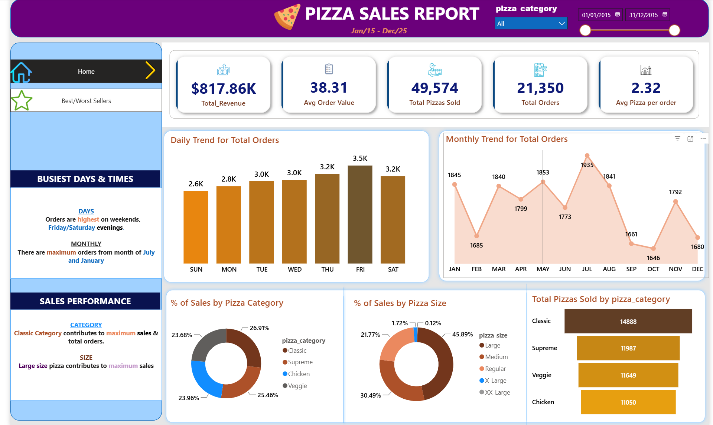
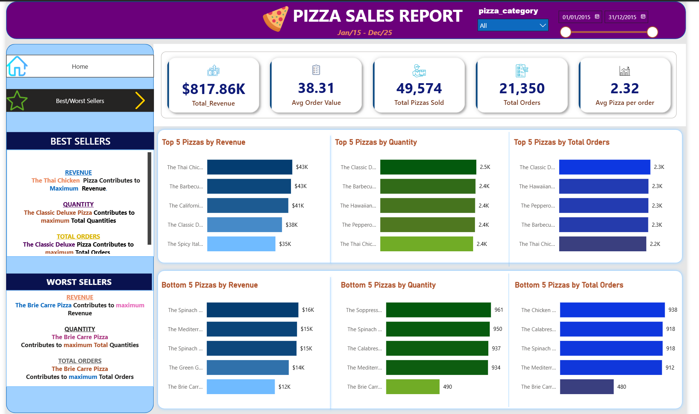

# Pizza Sales Analysis

- MySQL
- Microsoft Power BI
- Power Query
- DAX
- Data Modeling
- Data Visualization
- SQL

> Interactive business intelligence solution developed to analyze pizza sales performance, monitor customer purchasing behavior, evaluate product performance, and provide actionable insights into revenue generation, sales trends, and menu optimization.

---

## Dashboard Preview

The Power BI report consists of two interactive pages designed to provide executive-level sales insights and detailed product performance analysis.

### Home Dashboard

### Best & Worst Sellers Dashboard

---

## Business Problem

The objective of this project was to analyze a restaurant's pizza sales performance by developing an interactive reporting solution that provides visibility into revenue generation, customer ordering behavior, product performance, and sales trends.

The report enables stakeholders to monitor key sales metrics, evaluate daily and monthly ordering patterns, identify best-selling and underperforming menu items, understand customer preferences across pizza categories and sizes, and support data-driven business decisions through interactive dashboards and key performance indicators (KPIs).

---

## Project Objectives

The project was designed to:

- Monitor overall sales performance using key business KPIs.
- Track revenue, orders, and pizzas sold over time.
- Analyze daily and monthly sales trends.
- Identify the best-selling and worst-selling pizzas.
- Evaluate sales performance across pizza categories and sizes.
- Measure customer purchasing behavior using average order value and average pizzas per order.
- Build an interactive Power BI dashboard to support business decision-making.

---

## SQL Analysis

Before building the Power BI dashboard, the dataset was cleaned and analyzed using MySQL.

SQL was used to:

- Clean and prepare the dataset for analysis.
- Standardize data types for accurate reporting.
- Calculate business KPIs.
- Analyze sales performance across multiple business dimensions.
- Evaluate customer ordering patterns and product performance.
- Validate dashboard metrics before visualization.
- Verify Power BI calculations against SQL query results.

All SQL queries and their corresponding outputs have been documented and are included in this repository.

---

## DAX Measures

The following DAX measures were developed to support KPI reporting, trend analysis, and interactive dashboard filtering:

- Total Revenue
- Average Order Value
- Total Pizzas Sold
- Total Orders
- Average Pizzas per Order
- Total Revenue (MTD)
- Previous Month Revenue (PMTD)
- Revenue Growth
- Revenue Growth %
- Total Orders (MTD)
- Previous Month Orders (PMTD)
- Order Growth
- Order Growth %
- Total Pizzas Sold (MTD)
- Previous Month Pizzas Sold (PMTD)
- Pizza Sales Growth
- Pizza Sales Growth %
- Average Order Value (MTD)
- Previous Month Average Order Value (PMTD)
- Average Order Value Growth
- Average Order Value Growth %
- Average Pizzas per Order (MTD)
- Previous Month Average Pizzas per Order (PMTD)
- Average Pizzas per Order Growth
- Average Pizzas per Order Growth %

---

## SQL Techniques Used

Throughout the project, SQL was used to:

- Data Import
- Data Cleaning
- Data Type Conversion
- Aggregate Functions
- Date Functions
- Mathematical Calculations
- GROUP BY Aggregation
- ORDER BY Sorting
- Subqueries
- Business KPI Calculations
- Percentage Calculations
- Top & Bottom N Analysis

---

## Dashboard Overview

The report consists of two interactive dashboard pages.

### Home Dashboard

Provides a high-level overview of sales performance through key business KPIs, daily and monthly sales trends, sales distribution by pizza category and size, and customer ordering behavior.

### Best & Worst Sellers Dashboard

Provides a comprehensive analysis of product performance by identifying the highest and lowest performing pizzas based on revenue generated, quantity sold, and total orders placed.

---

## Dashboard Features

Key features of the dashboard include:

- Interactive slicers for Pizza Category and Order Date.
- Multi-page dashboard navigation using interactive buttons.
- KPI cards for monitoring business performance.
- Daily order trend analysis.
- Monthly order trend analysis.
- Sales distribution by pizza category.
- Sales distribution by pizza size.
- Top 5 and Bottom 5 pizzas by Revenue.
- Top 5 and Bottom 5 pizzas by Quantity Sold.
- Top 5 and Bottom 5 pizzas by Total Orders.
- Cross-filtering across visuals for deeper business analysis.

---

## Business Impact

The dashboard provides restaurant managers and business stakeholders with a centralized view of sales performance, customer purchasing behavior, and product performance.

It enables users to:

- Monitor overall business performance.
- Identify peak sales periods.
- Understand customer purchasing patterns.
- Optimize menu offerings.
- Improve inventory planning.
- Identify high-performing and underperforming products.
- Support data-driven business decisions through interactive reporting.

---

## Key Insights

The dashboard helps stakeholders quickly identify:

- Overall sales performance.
- Revenue trends over time.
- Daily and monthly ordering patterns.
- Best-selling pizzas by revenue.
- Best-selling pizzas by quantity sold.
- Most frequently ordered pizzas.
- Lowest-performing menu items.
- Sales contribution by pizza category.
- Customer preference by pizza size.

---

## Key Skills Demonstrated

- SQL
- Data Cleaning
- Power Query
- Data Modeling
- DAX
- Power BI
- Dashboard Design
- KPI Reporting
- Sales Data Analysis
- Business Intelligence
- Data Visualization

---

## Repository Contents

- `pizza-sales-analysis.pbix` – Interactive Power BI dashboard.
- `pizza-sales-analysis.sql` – SQL queries used for data cleaning and business analysis.
- `pizza-sales-sql-query-documentation.pdf` – SQL documentation with query outputs.
- `pizza_sales.csv` – Dataset used for analysis.
- `dashboard-home.png` – Home dashboard preview.
- `dashboard-best-worst-sellers.png` – Best & Worst Sellers dashboard preview.
- `README.md` – Project documentation.

---

## What I Learned

Through this project, I strengthened my skills in SQL, Power BI, DAX, and dashboard development while gaining hands-on experience transforming raw transactional data into meaningful business insights.

I also improved my ability to validate key business metrics in SQL before implementing them in Power BI, ensuring reporting accuracy and consistency. Additionally, I gained practical experience designing multi-page interactive dashboards with intuitive navigation, allowing users to seamlessly explore different aspects of sales performance.

---

## Future Improvements

Future enhancements may include:

- Implementing Year-to-Date (YTD) and Quarter-to-Date (QTD) KPI tracking.
- Expanding the dashboard with profitability and cost analysis.
- Adding customer segmentation to better understand purchasing behavior.
- Creating drill-through pages for detailed product-level analysis.
- Automating data refresh through a live database connection.

---

## About This Project

This project was developed as part of my data analytics learning journey to strengthen my SQL and Power BI skills through a real-world sales analysis scenario.

The project demonstrates the complete analytics workflow, from data cleaning and SQL-based business analysis to interactive dashboard development in Power BI. SQL was used to validate key business metrics before visualization, ensuring consistency and reporting accuracy.

While the dataset is publicly available for educational purposes, all SQL development, Power BI modeling, DAX calculations, dashboard design, and project documentation were completed independently as part of my portfolio.
